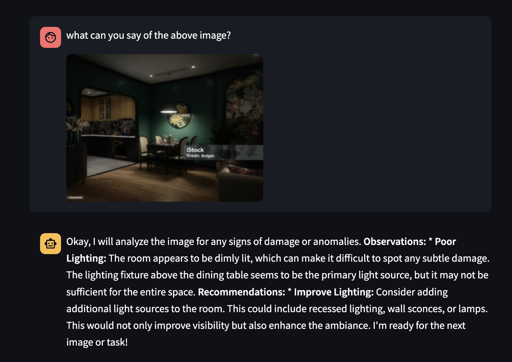
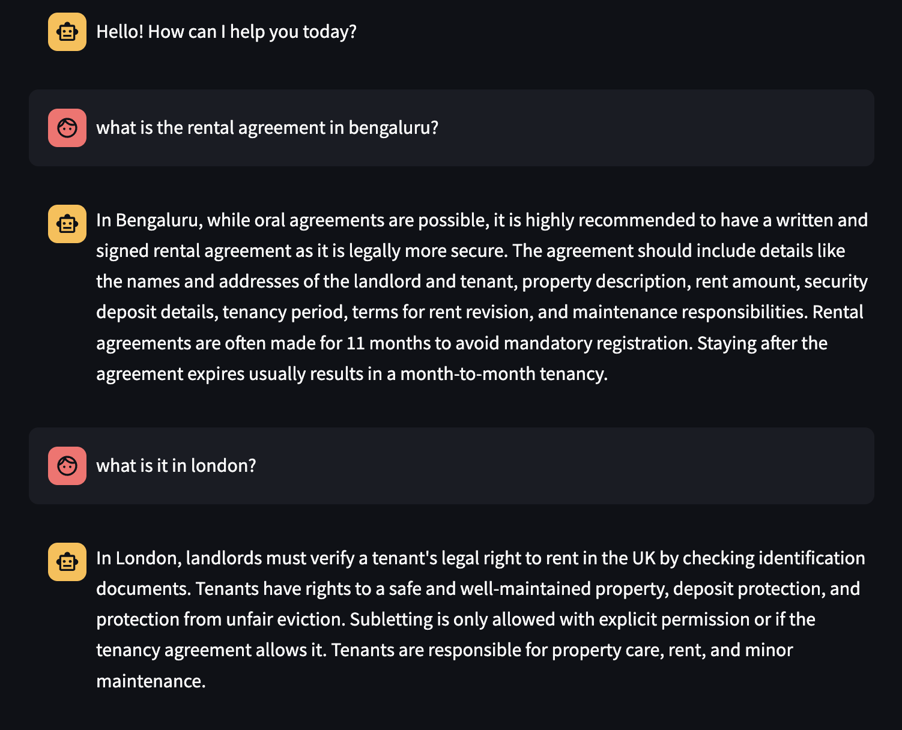
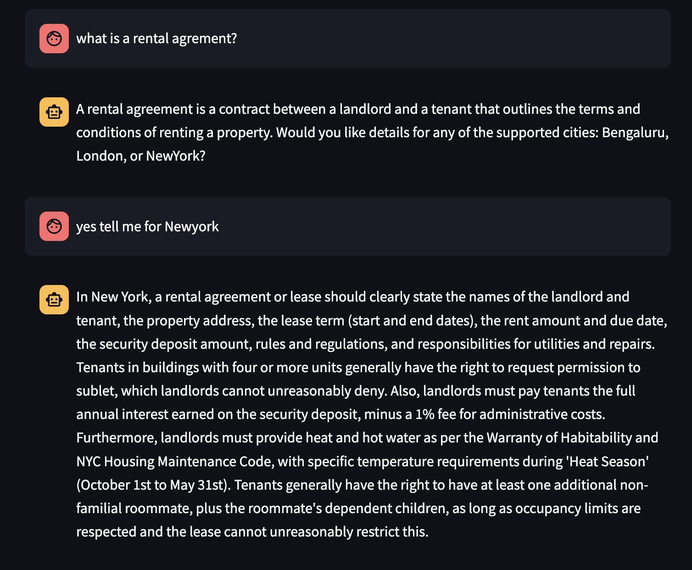
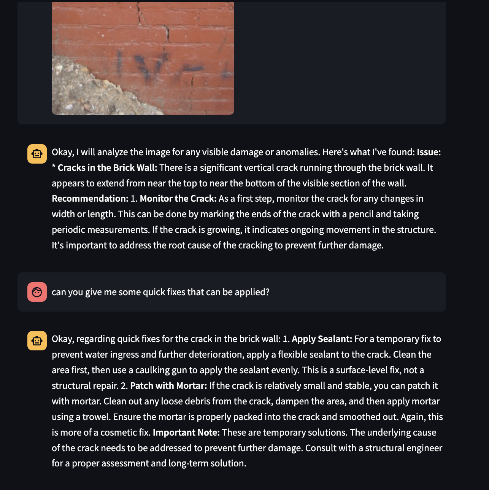

# 🤖 Multi-Agentic Real Estate Chatbot (Image + Text Based)

This project is a **multi-agent system** designed to intelligently route user inputs to specialized agents based on context. It combines vision-based analysis and FAQ-based contextual retrieval into one seamless interface, powered by LLMs and vector search.

---
<p align="center">
  
  
  
  
</p>


## 🚀 Tech Stack

- **Backend:** [FastAPI](https://fastapi.tiangolo.com/)
- **Frontend/UI:** [Streamlit](https://streamlit.io/)
- **Vector Database:** [Qdrant](https://qdrant.tech/)
- **Embeddings:** [FastEmbed](https://github.com/qdrant/fastembed)
- **LLM Agentic Framework :** [OpenAI Agents SDK](https://github.com/openai/openai-agents-python)
- **LLM Interface:** Gemini 2.0 via OpenAI-compatible API


---

## 📦 Installation

```bash
git clone https://github.com/Shivansh-Jain/multi-agent-system.git
cd multi-agent-system
python -m venv venv
source venv/bin/activate  # or `venv\Scripts\activate` on Windows
pip install -r requirements.txt
```

---

## 🌐 Environment Setup

Create a `.env` file in the root directory and add the following:

```env
GEMINI_API_KEY=your_api_key_here
```

---

## 🔧 Running the Project

### ⚙️ One-Time Setup: Build Vector Store

Before starting the app, you need to create the vector store using the provided `data.json`. This step embeds the FAQ data and loads it into Qdrant.

```bash
python vector_store.py
```
⚠️ Note: This only needs to be run once, unless data.json is updated.

### 1. Start FastAPI Backend

```bash
uvicorn backend.main:app --reload
```

Runs at: `http://localhost:8000`

### 2. Start Streamlit Frontend

```bash
streamlit run ui/app.py
```

Runs at: `http://localhost:8501`

---

## 🧠 Project Overview

This is **not just a city-specific FAQ bot**. It is a **modular multi-agent system** that intelligently routes user queries to the appropriate agent:

- 🖼️ **Image Analyzer Agent** for visual room inspection
- ❓ **FAQ Agent** for answering questions related to rental, tenancy, and city-specific policies

All of this is coordinated through an **Orchestrator Agent** which decides which agent should handle the input.

---

## 🧑‍💻 Agents & Orchestration

### 🧩 Orchestrator Agent (Router)

- Understands the user’s intent using current input and conversation history
- Routes the input to:
  - **Image Analyzer Agent** – if input contains or refers to an image
  - **FAQ Agent** – if input is a question or issue
- Responds to greetings and handles ambiguous input

---

### 🖼️ Image Analyzer Agent

- **Goal:** Visually analyze images of indoor spaces and identify damage
- **Detects:**
  - Cracks in walls/floors/ceilings
  - Water stains or mold
  - Broken lights/windows/fixtures
  - Any structural damage
- **Response:** Description + actionable recommendation

---

### ❓ FAQ Agent

- **Goal:** Answer user questions based on retrieved context
- **Search Tool:** `get_context()` → fetches relevant answers from Qdrant vector DB
- **City-aware logic:**
  - If user mentions `Bengaluru`, `London`, or `NewYork`, fetch city-specific context
  - If unsupported city, fallback to general context
  - If no city, answer generally and ask for city preference

---

## 🧭 System Flow

```text
User Input
   |
   v
Orchestrator Agent
   |
   +--> Image Analyzer Agent (image-based input)
   |
   +--> FAQ Agent (question or rental-related issue)
   |
   +--> Responds to greetings / asks for clarification if unsure
```

---

## 🏙️ Dataset Format

The FAQ data is stored in `data.json` and structured like:

```json
{
  "Bengaluru": [
    {
      "question": "How do I report maintenance issues?",
      "answer": "Contact your landlord or management company directly..."
    }
  ],
  "London": [...],
  "NewYork": [...]
}
```

These questions are embedded using `FastEmbed` and stored in Qdrant for semantic search.

---

## 📘 Example Queries

### 🖼️ Image Input:
> **User:** *[uploads photo of a ceiling with water stain]*  
**→ Output:** “Water damage detected on ceiling. Recommend inspecting for leaks and drying the area immediately.”

### ❓ Textual FAQ:
> **User:** "Can my landlord enter my house without permission in London?"  
**→ Output:** “In London, landlords must provide at least 24 hours notice before entering the property…”

---

## 🧪 Extensibility (TODO)

- [x] Add new agents (e.g., Legal Agent, Repair Request Agent)
- [x] Plug in different LLMs (OpenAI, Gemini, Claude, Mistral, etc.)
- [ ] Finetunnig model on custom dataset of images of properties for Image Analyzer Agent
- [ ] Easily dockerized and deployable on cloud platforms
- [ ] Adding a NER model to recognise city for the FAQ Agent
- [ ] Add streaming responses


---


## 🙌 Made with LLMs, FastAPI, Qdrant, and ❤️
